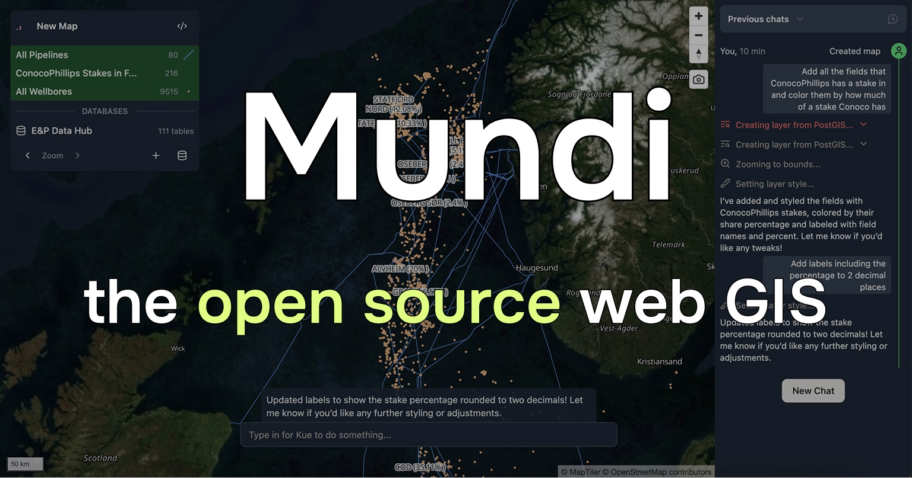

<h4 align="center">
  
  
  
  
</h4>

# Introduction

Anway is an open source web GIS built around AI:

- Supports vector, raster, and point cloud data
- Connects to and queries spatial databases like PostGIS
- Uses LLMs to call geoprocessing algorithms and edit symbology

Anway is self-hostable and open source under the AGPLv3 license, with full support for local LLMs.

## Self-hosting Anway

Anway is open source (AGPLv3) and can run entirely on your local machine with local LLMs.

Self-hosting requires a good computer/server, git, and Docker. You can optionally connect it to a local LLM (or any
provider that supports the chat completions API).

Give us a [star on GitHub](https://github.com/BuntingLabs/mundi.ai),
[join our Discord to talk to us](https://discord.gg/V63VbgH8dT), or
[create a pull request](https://github.com/BuntingLabs/mundi.ai/pulls) to contribute back!

## Contributing

We welcome contributions to Anway! The best contributions are often a blend of your inspiration, plus our implementation guidance. Discussing ideas with us [in our Discord](https://discord.gg/V63VbgH8dT) or on GitHub issues is a great way to socialize a potential contribution.

1. We value end-to-end test coverage as a way of ensuring code quality. Great contributions should come with great tests, but we know 100% code coverage is not the goal.

2. We'll ask you to sign a contributor license agreement (CLA). This allows us to continue to sell on-premise Anway, which finances this project's development and allows us to share open source Anway with the world.

3. Contributions that add significant dependencies (e.g. new Docker images) will be weighed against the cost it adds to self-hosting. Self-hosted Anway is lightweight, which makes it accessible to a wide range of users on varying hardware.

## Security

Bunting Labs takes potential security issues seriously. If you have any concerns about Anway or believe you have uncovered a vulnerability relating to Anway, please get in touch via [support@buntinglabs.com](mailto:support@buntinglabs.com).

Please do not file security-related GitHub issues, because this may compromise the security of our users.

## License

Anway is licensed as [AGPLv3](./LICENSE).

Optionally, Anway can use [QGIS](https://qgis.org/) for geoprocessing.
[The code that links with QGIS](./qgis-processing) is licensed
as [GPLv3](./qgis-processing/LICENSE).
