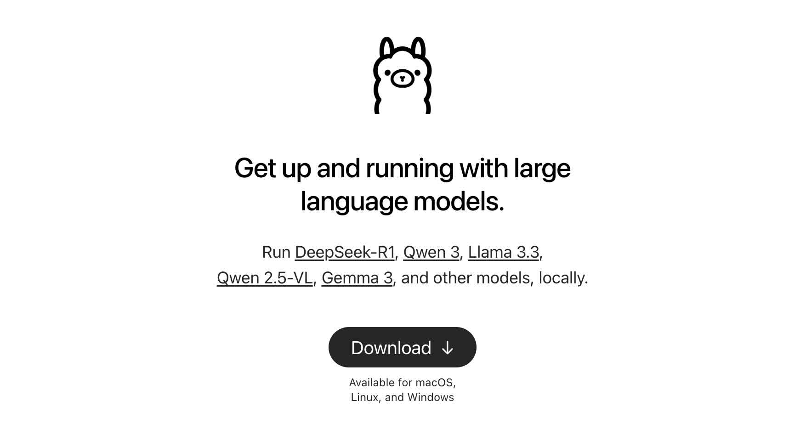
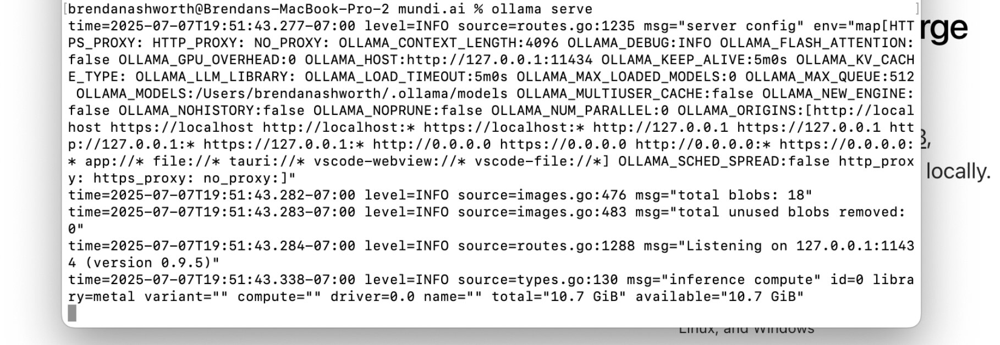
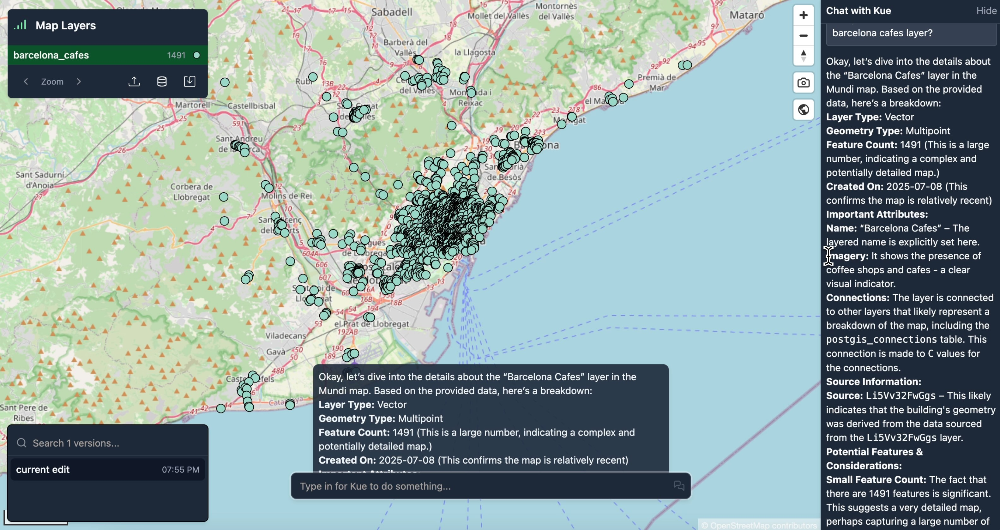

[Mundi](https://mundi.ai/) is an open source web GIS that can connect to local language models when
self-hosted on your computer. It is compatible with the
[Chat Completions API](https://ollama.com/blog/openai-compatibility),
which is supported by [Ollama](https://ollama.com/), the most popular software
for running language models locally. Running Ollama allows you to use Mundi's
AI features completely for free, offline, without data leaving your computer.

[](https://ollama.com)

This tutorial will walk through connecting Mundi to Ollama running
[Gemma3-1B](https://ollama.com/orieg/gemma3-tools:1b) on a MacBook Pro.
[Gemma3-1B was trained by Google](https://deepmind.google/models/gemma/gemma-3/)
and is light enough to run quickly on a laptop without a GPU. Here, I'm using
a 2021 MacBook Pro with an M1 Pro chip.

## Prerequisites

Before you begin, ensure you have the following set up:

1.  **Mundi running on Docker Compose** You must have already cloned the
    [`mundi.ai` repository](https://github.com/BuntingLabs/mundi.ai)
    and built the Docker images. If you haven't, follow the
    [Self-hosting Mundi](/deployments/self-hosting-mundi/) guide first.

2.  **Ollama installed and running.** Download and install Ollama for your
    operating system from the [official website](https://ollama.com).

3.  **An Ollama model downloaded.** You need to have a model available for
    Ollama to serve. For this guide, we'll use [`gemma3-tools`](https://ollama.com/orieg/gemma3-tools:1b),
    a model that supports tool
    calling. Open your terminal and run:
    ```bash
    ollama run orieg/gemma3-tools:1b
    ```
    This model requires about 1GiB of disk space.

You can use any model supported by Ollama, including Mistral, Gemma, and Llama models.

## Configuring Mundi to connect to Ollama

The connection between Mundi and your local LLM is configured using environment
variables in the `docker-compose.yml` file.

### Edit the Docker Compose file

In your terminal, navigate to the root of your `mundi.ai` project directory and
open the `docker-compose.yml` file in your favorite text editor.

```bash
vim docker-compose.yml
```

These example changes connect to `orieg/gemma3-tools:1b`:

```diff
--- a/docker-compose.yml
+++ b/docker-compose.yml
@@ -41,6 +41,9 @@ services:
        - REDIS_PORT=6379
-       - OPENAI_API_KEY=$OPENAI_API_KEY
+       - OPENAI_BASE_URL=http://host.docker.internal:11434/v1
+       - OPENAI_API_KEY=ollama
+       - OPENAI_MODEL=orieg/gemma3-tools:1b
     command: uvicorn src.wsgi:app --host 0.0.0.0 --port 8000
```


Here’s a breakdown of each variable:

*   **`OPENAI_BASE_URL`**: This points to the Ollama server.
    `host.docker.internal` is a [special DNS name](https://docs.docker.com/desktop/features/networking/)
    that lets the Mundi Docker
    container connect to services running on your host machine. `11434` is the
    default port for Ollama.
*   **`OPENAI_API_KEY`**: When using Ollama, this key can be set to any non-empty
    string. We use `ollama` by convention.
*   **`OPENAI_MODEL`**: This tells Mundi which Ollama model to use for its
    requests. We're using the `orieg/gemma3-tools:1b` model we downloaded earlier.

Save the changes to your `docker-compose.yml` file and exit the editor.

## Restart Mundi to use new LLM details

With the configuration complete, you can now restart Mundi and verify its
connection to your local LLM. If you already had Docker Compose running,
hit `Ctrl+C` to stop the services.

### Start the Ollama server

If it's not already running, open a new terminal window and start the Ollama
server.

```bash
ollama serve
```

You should see output indicating that the server is waiting for connections.



### Start the Mundi application

In your original terminal window (in the `mundi.ai` directory), bring up the Mundi
application.

```bash
docker compose up app
```

The terminal will show logs as the Mundi services start. Once it's ready, you'll
see a message that the database migrations have completed successfully.


### Test the connection in Mundi

Now you can interact with Kue, Mundi's AI assistant, which is now powered by
your local LLM.

Open your web browser and navigate to [`http://localhost:8000`](http://localhost:8000).

If you don't already have a map with data you want to investigate, upload a new GIS data
file like a GeoPackage. In this example, we'll use a file that contains OpenStreetMap data
of cafes in Barcelona. You can just drag the file onto the map.

Then, ask Kue any question relating to your data:

:::tip[Request to Kue]
can you tell me about the barcelona cafes layer?
:::

Kue can then analyze the layer using your local Ollama model and provide a
detailed summary, including the layer type, geometry, feature count, and
more. If your LLM model supports it, it can call tools to analyze the data
as well, like QGIS geoprocessing algorithms.



## Critically evaluating Kue's response

Mundi's AI agent, Kue, gives the following response, which is at about
the quality we would expect from a local 1B-parameter model:

> Okay, let's dive into the details about the "Barcelona Cafes" layer
> in the Mundi map. Based on the provided data, here's a breakdown:
>
> **Layer Type**: Vector
> **Geometry Type**: Multipoint
> **Feature Count**: 1491 (This is a large number, indicating a complex and potentially detailed map.)
> **Created On**: 2025-07-08 (This confirms the map is relatively recent.)

This all seems to be correct, mostly regurgitating the description of the layer
given to it in its prompt.

> **Important Attributes**:
> *   **Name**: "Barcelona Cafes" - The layered name is explicitly set here.
> *   **Imagery**: It shows the presence of coffee shops and cafes - a clear visual indicator.
> *   **Connections**: The layer is connected to other layers that likely represent a breakdown
> of the map, including the postgis_connections table. This connection is made to C values for
> the connections.

This isn't entirely correct, it's a vector file, so it's not connected to PostGIS.

> **Source Information**:
> *   **Source**: ... - This likely indicates that the building's geometry was derived from the data sourced from the ... layer.
>
> **Potential Features & Considerations**:
> *   **Small Feature Count**: The fact that there are 1491 features is significant. This suggests a very detailed map, perhaps capturing a large number of individual cafes.
> *   **Spatial Relationships**: The layer is linked to more general layers which likely represent the map's overall structure.

That's how you use Mundi with a local LLM!
