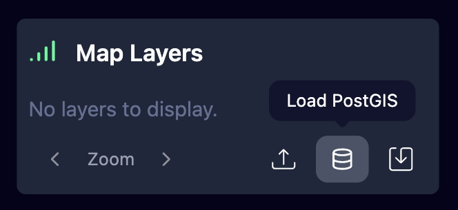
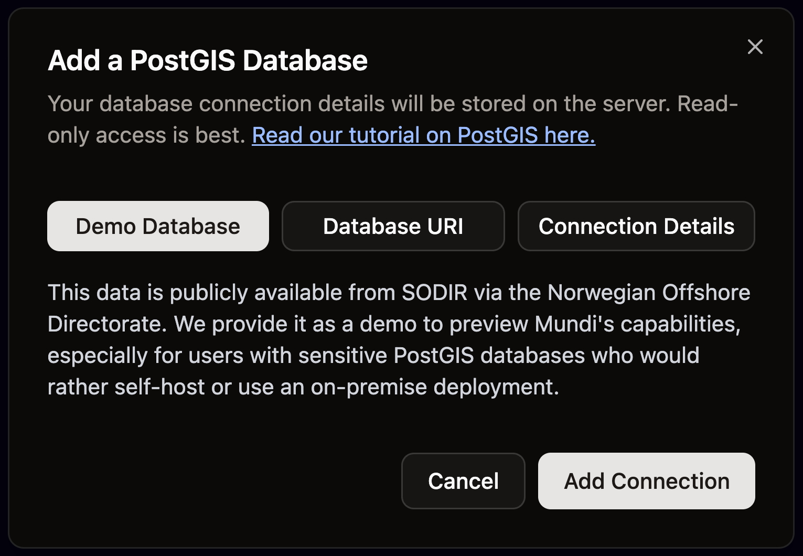
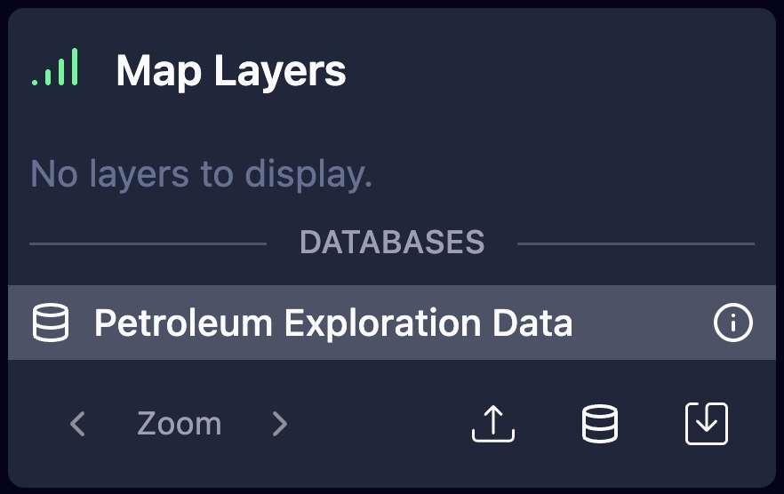

Mundi is built to help you make your spatial database easy to use. We've built a demo PostGIS database of Norweigan oil and gas data that you can connect to and experience the power of Mundi.

This guide will walk you through how to connect to the demo PostGIS and see the database wiki.

## Connecting to the database

Once you've created your first map, you can find the demo database inside the database connection menu.

1.  Click the **Load PostGIS** icon to get started.

2.  The **Add a PostGIS Database** menu will open.

3.  Click the **Demo Database** button, then **Add Connection** in the lower right to conect to the database.

4. The connection will take about 2 minutes to load. If it takes longer than 2 minutes, refresh the page.

## Reading the PostGIS Wiki

When you connect to a PostGIS database, Mundi generates a wiki of the database. It outlines major concepts as well as relationships between data.

To see the wiki, left click on the name of the database you want to see the wiki of.

## Working with the example PostGIS

The demo database behaves in the same way that your own PostGIS would. To see all you can do with Mundi and spatial databases, read this section of the documentation: [Working with PostGIS database](/guides/connecting-to-postgis/#working-with-postgis-database)