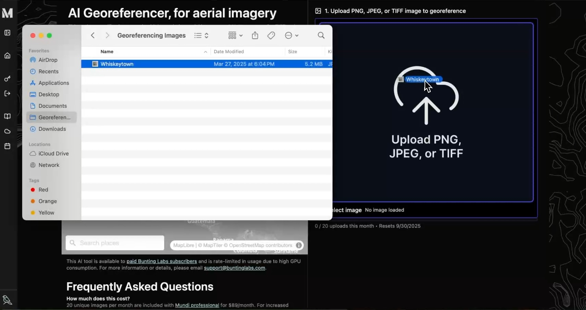
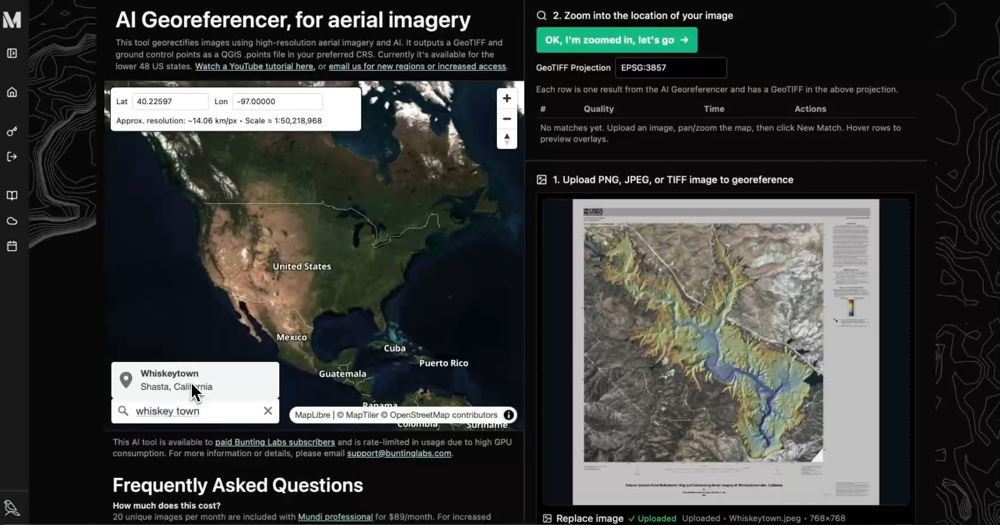
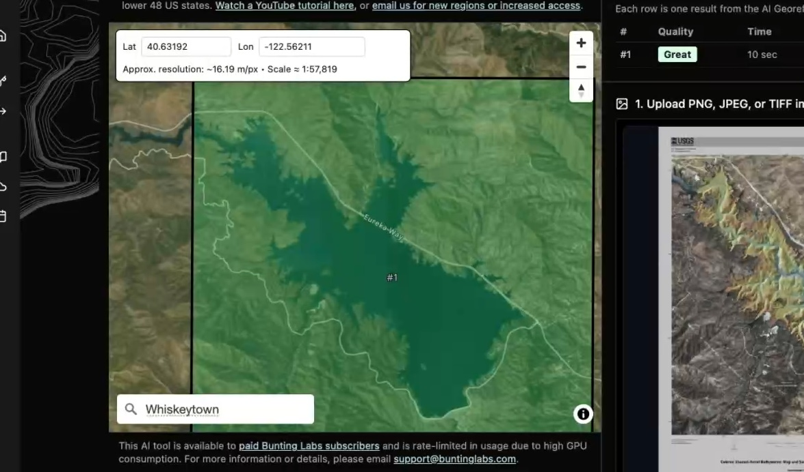
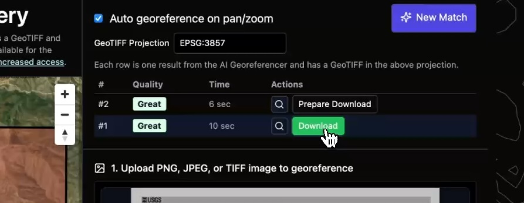

The [AI Georeferencer](https://app.mundi.ai/ee/georeferencer) in Mundi takes
any PNG, JPEG, or TIFF, and turns it into a GeoTIFF automatically. It works by comparing your image
directly to high resolution (1 meter/pixel) reference imagery to detect ground control
points, just as you would if you were manually georectifying it in ArcGIS or QGIS.
Our AI takes 10 seconds per image, on average, and gives you the ground control points (GCPs)
so you can manually adjust after.

Because our AI is robust, it works on satellite and aerial imagery, both
historical and modern drone photography, and scanned maps with annotations
or legends. The most common use case is
[bulk georectifying of scanned analog aerial photographs](https://mundi.ai/ai-georeferencering-for-aerial-imagery)
like this one:

:::note[Requires Mundi Professional]
Running the AI Georeferencer is GPU-intensive, and as such, we require an
[active Mundi professional subscription](https://mundi.ai/pricing) to use it.
:::

## How to use the AI Georeferencer

<iframe width="560" height="315" style="height: 315px;" src="https://www.youtube.com/embed/9ybtQ40d5TE?si=t-Wr70t1rGVGMcyT" title="YouTube video player" frameborder="0" allow="accelerometer; autoplay; clipboard-write; encrypted-media; gyroscope; picture-in-picture; web-share" referrerpolicy="strict-origin-when-cross-origin" allowfullscreen></iframe>

In this guide, we will walk through georeferencing a
[USGS bathymetric map of Whiskeytown Lake, California](https://www.usgs.gov/data/bathymetry-topography-and-orthomosaic-imagery-whiskeytown-lake-northern-california-ver-20-july).
Despite its thick white border, legend, and overlaid bathymetric symbology, the georeferencer
achieves 2-3 meter accuracy on its first try.

### Upload the target image

The first step is to upload the image you want to georeference. The tool
accepts PNG, JPEG, or TIFF formats.

You can either drag and drop your file into the upload area on the right side
of the screen or click the area to open a file selector.

### Zoom to the approximate location

Once your image is loaded, you need to provide the AI with a general area to
search for matches. On the left-hand map panel, navigate to the approximate
location of your image. The AI can see the bounding box of your map and your zoom level.

You can do this in two ways:

-   **Search:** Use the "Search places" bar to find a known location by name,
    like a city or landmark.
-   **Coordinates:** If you know the approximate latitude and longitude, you
    can enter them in the boxes at the top of the map panel.

For this example, we'll search for "Whiskeytown". The map will automatically
pan and zoom to the correct location in California. The zoom level does not
need to be exact, but the map view should contain the full extent of your
uploaded image.

:::note
A good rule of thumb is to be within about 2x the scale of the source image, either too-zoomed-in or too-zoomed-out.
:::

### Run the AI Georeferencer

With the map correctly positioned, click the green **OK, I'm zoomed in, let's
go &rarr;** button. The AI will immediately begin processing.

The tool automatically detects changes in the map view. If the initial result
isn't accurate, you can simply pan or zoom the map slightly, and the AI will
automatically run again to find a better match. To maintain manual control,
disable "Auto georeference on pan/zoom" and hit **New Match** each time.

Within about 10 seconds, one or more potential matches will appear in a table
above the image upload area. Each match is given a quality rating, such as
"Great," "OK," or "Poor."

### Preview the geotransform bounds

Before downloading, you can verify the accuracy of the match. Hover your
mouse over a result row in the table. A preview of your georeferenced image
will be overlaid on the map panel with partial transparency, allowing you to
see how well it aligns with the underlying base map.

### Downloading as a GeoTIFF

Once you are satisfied with a match, you can download the georeferenced
output. Because the AI Georeferencer is a GPU-intensive process, downloading
the final results requires a [**Mundi Professional** subscription](https://mundi.ai/pricing).

1.  Click the **Prepare Download** button on the row for your chosen match.
2.  The system will generate a ZIP archive containing the GeoTIFF and a GCP
    file. Once ready, the button will change to **Download**.
3.  Click **Download** to save the archive to your computer.

The ZIP file contains:
-   A **GeoTIFF** (`georeferenced.tif`) warped using the best GCPs.
-   A **GCP file** (`.points`) that can be loaded into QGIS for manual warping
    or inspection.

The GeoTIFF will be in the projection you requested, which defaults to `EPSG:3857`.

Here is the scanned analog aerial photograph that we mentioned earlier, after using
the AI Georeferencer on it while zoomed into Santa Barbara, CA. Note that it's been rotated nearly
180° automatically by the AI.

You can drag the resulting GeoTIFF into most GIS software, like [QGIS](https://qgis.org) or [Mundi](https://app.mundi.ai).

## Accuracy and troubleshooting

Once the AI successfully locates your image, you should expect **1-3 meter
accuracy**, depending on your zoom level. Individual ground control points may have higher error, but the
overall warp is generally very precise.

-   **Low-Resolution Imagery:** If your input image has a resolution lower than
    1 meter per pixel, the final accuracy will be limited by your source
    data. Expect an error higher than one pixel's equivalent ground distance.
-   **Poor Initial Match:** If the result's bounding box is dramatically off,
    the AI may need a better hint. Adjust the pan and zoom of the map on the
    left and the tool will automatically rerun. Zooming in closer to the
    target area often helps.

## Technical details

### Input image requirements

For the best results and performance, please adhere to the following
guidelines for your input image:

-   **File Size:** We recommend keeping uploaded input images under **25 MiB**.
-   **Dimensions:** It is not advantageous to
    provide an image with its longest edge greater than **2,000 pixels**. For very
    large images (over 10,000px on one side), the tool will downscale the output.
    To georeference very large images, it is better to pass a downsampled version
    to the tool and then use the resulting GCP `.points` file to warp your
    original high-resolution image in a desktop GIS.
-   **Resolution:** We recommend an input image resolution no higher than
    **0.25 meters per pixel**. For aerial or drone imagery with higher resolution,
    you will get better performance by downsampling it beforehand.

### Warping algorithm

We generally warp using a third order polynomial and cubic resampling.

### Projections

You can request any output projection for your GeoTIFF, but ground control points
are detected and matched in Web Mercator (EPSG:3857).

### Orthorectification

The tool does not directly incorporate a Digital
Elevation Model (DEM) in its calculations. This may result in mountain ranges
not being uniformly and correctly located. However, our reference aerial
imagery is orthographic.

## Region support

<iframe style="height: 400px;" src="https://app.mundi.ai/api/projects/embed/v1/PhVt9RyLXLMp.html"  width="800"  height="600"  frameborder="0"></iframe>

Currently, the AI Georeferencer is available for:

- **Continental United States (lower 48 states)**
- Netherlands
- Poland
- Spain
- France
- Switzerland
- Taiwan

All regions except CONUS have 30cm resolution. CONUS is at 1m resolution.

We are adding new regions one by one to ensure our reference aerial imagery is
high-resolution and accurately georectified. If you would like to request support
for a new region, please email us at [support@buntinglabs.com](mailto:support@buntinglabs.com).
