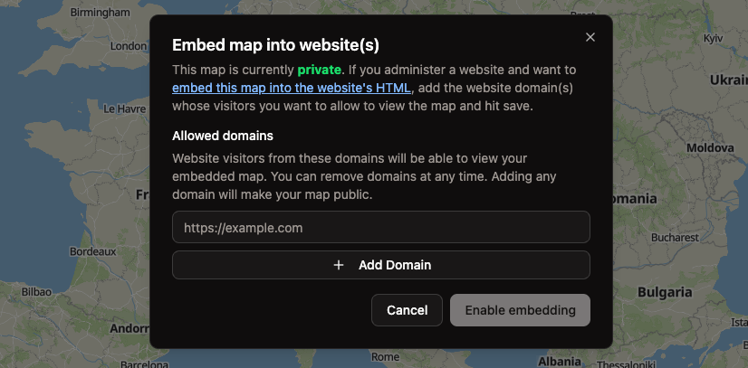
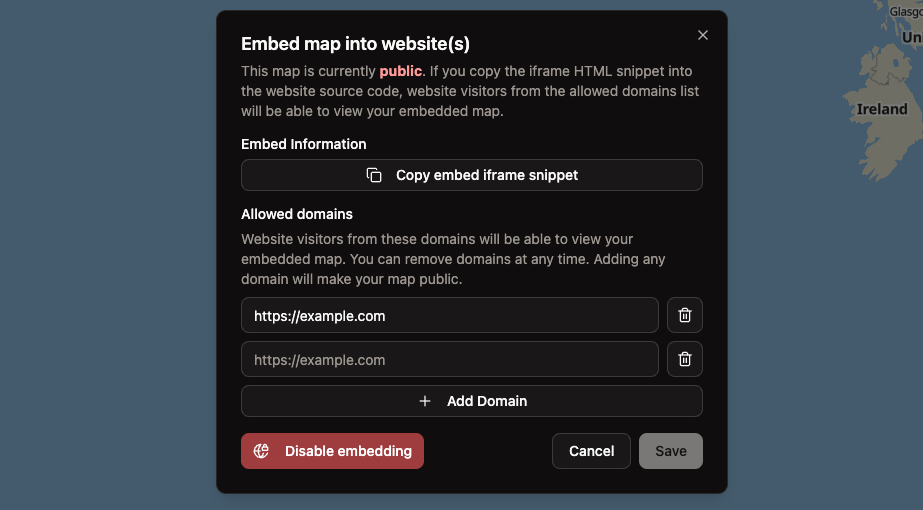

You can embed any map made with Mundi (manually or created via API) into your website, both on Mundi cloud and open
source Mundi.

<iframe
  src="https://app.mundi.ai/api/projects/embed/v1/PHADgnGVJ3qz.html"
  width="600"
  height="400"
  style="height: 400px; margin-left: auto; margin-right: auto;"
  frameborder="0">
</iframe>

Map embeds are via `iframe` tags and present a read-only view of the map, zoomed to the data that's loaded.


## Embedding maps from Mundi cloud

Exposing maps to third-party websites is done using the **Embed into website** button at the top right
of the layer list widget.


This will bring up a window that asks you to list your allowed domains.

:::note
Enabling embedding makes your map public, regardless of if *your website* is password protected.
:::



### Listing allowed domains

To make the map accessible to your website, let's say you're hosting a page on `https://example.com/foo/bar`.
We'll add `https://example.com` to the allowed domains list. Then, any page on that domain can embed
the map. The `http://` and `https://` must correctly match. Catch-all domains like `*.example.com` are
not supported.



You can then copy the iframe HTML snippet into your website source code wherever you want the map to
appear, and edit the width and height attributes accordingly. The iframe snippet will look like this:

```html
<iframe
  src="https://app.mundi.ai/api/projects/embed/v1/YOUR_PROJECT_ID.html"
  width="800"
  height="600"
  frameborder="0">
</iframe>
```

If you want to undo this, you can hit the **Disable embedding** button at any time, which will
lock all third-party users out of the map.

## Embedding maps from self-hosted

When running self-hosted Mundi, embedding maps is done globally across all maps using environment
variables.

### Allow requests from external domains

The first step to allow web browsers to load a map embedded into another website's domain is to
add the domain to the `MUNDI_EMBED_ALLOWED_ORIGINS` environment variable. You can find environment
variables in the `docker-compose.yml` file.

```diff
--- a/docker-compose.yml
+++ b/docker-compose.yml
@@ -41,6 +41,12 @@ services:
        - REDIS_PORT=6379
        - OPENAI_API_KEY=$OPENAI_API_KEY
+       - MUNDI_EMBED_ALLOWED_ORIGINS=https://example.com,http://secondwebsite.org
     command: uvicorn src.wsgi:app --host 0.0.0.0 --port 8000
```

<iframe
  src="http://localhost:5173/api/projects/embed/v1/PjBUgZMTrvf7.html"
  width="800"
  height="600"
  frameborder="0">
</iframe>

`MUNDI_EMBED_ALLOWED_ORIGINS` accepts a comma-separated list of domains with HTTP or HTTPS (no comma if just one).
Domains added here will be allowed to embed maps from your Mundi instance.

### Creating the iframe

On your target website HTML, you can embed a given map project like so:

```html
<iframe
  src="https://YOUR_MUNDI_INSTANCE/api/projects/embed/v1/YOUR_PROJECT_ID.html"
  width="800"
  height="600"
  frameborder="0">
</iframe>
```

Here, you'll replace `YOUR_MUNDI_INSTANCE` with wherever you're hosting Mundi along with
`YOUR_PROJECT_ID` with the project ID of the map you want to embed.

If you have open a map project in Mundi, the URL might look like `localhost:8000/project/PZmyKibVZCb3`.
The project ID is `PZmyKibVZCb3` in this case and uniquely identifies the map project.
